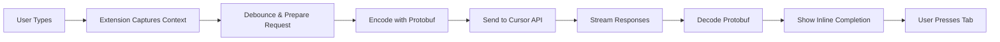

# Cursor Unchained - VS Code Extension

<div align="center">

**Bring Cursor's legendary Tab completion to VS Code!**

[](https://code.visualstudio.com/)
[](LICENSE)

</div>

---

## ✨ Features

- 🚀 **Real-time inline completions** - Just like Cursor's Tab complete
- ⚡ **Streaming API** - Fast, real-time suggestions as you type
- 🌐 **Multi-language support** - JavaScript, TypeScript, Python, Go, and more
- 🎨 **Easy configuration** - Simple webview panel for setting up credentials
- ⚙️ **Configurable models** - Choose between "fast" or "slow" model
- 🛡️ **Privacy focused** - No data collection, direct API calls to Cursor

---

## 📸 Quick Preview

Start typing in VS Code and watch as intelligent completions appear in grey text. Press **Tab** to accept!

---

## 📦 Installation

### Prerequisites

- VS Code version 1.107.0 or higher
- A Cursor account (free or paid)
- Internet connection

### Step 1: Install the Extension

**Option A: From VSIX File (Recommended for this repo)**

1. Download or clone this repository
2. Build the extension (see [Building](#building) below)
3. Open VS Code
4. Press `Ctrl+Shift+P` (Windows/Linux) or `Cmd+Shift+P` (Mac)
5. Type `Extensions: Install from VSIX...` and press Enter
6. Navigate to the repository folder and select `cursor-unchained-*.vsix`
7. Restart VS Code

**Option B: Install from Marketplace** (coming soon)

---

## ⚙️ Setup

### Getting Cursor API Credentials

The extension needs credentials from Cursor to work:

1. **Open Cursor IDE**
2. Press `Cmd+Shift+P` (Mac) or `Ctrl+Shift+P` (Windows/Linux)
3. Type `Developer: Open Developer Tools for Extension Host`
4. In the Developer Tools, click on the **Network** tab

5. **Trigger a completion in Cursor:**
   - Open any file in Cursor
   - Start typing some code (e.g., `function calculate`)
   - Wait for a completion request to appear

6. **Find the request:**
   - Look for `StreamCpp` in the Network tab
   - Click on it
   - Go to the **Headers** section

7. **Copy these values from Request Headers:**

   | Header | Config Field | Example |
   |--------|--------------|---------|
   | `authorization` | **Bearer Token** | Copy the part after `Bearer ` (e.g., `eyJhbGci...Rbo`) |
   | `x-request-id` | **Request ID** | `bf276c83-41c1-4ebc-9932-5adeede37550` |
   | `x-session-id` | **Session ID** | `f711500d-8f46-40d7-93c5-5b860e2fd39f` |
   | `x-cursor-client-version` | **Client Version** | `2.2.44` |

> ⚠️ **Note**: The Bearer Token is a JWT that may expire. If completions stop working, you may need to refresh these credentials periodically.

### Configure in VS Code

1. In VS Code, press `Ctrl+Shift+P` to open the Command Palette
2. Type `Credentials Manager: Configure Cursor API Credentials`
3. A configuration panel will open in a webview
4. Fill in the following fields:
   - **Bearer Token**: The JWT token from the `authorization` header (everything after `Bearer `)
   - **Client Version**: The version from `x-cursor-client-version` header
   - **Request ID**: The value from `x-request-id` header
   - **Session ID**: The value from `x-session-id` header
5. Click **Save Configuration**

### Alternative: Manual Configuration

You can also configure via VS Code Settings:

1. Press `Ctrl+,` to open Settings
2. Search for `cursorUnchained`
3. Fill in the required fields in the **Cursor Unchained** section

---

## 🎯 Usage

### Basic Tab Completion

1. Open any file in VS Code
2. Start typing code
3. Tab completion suggestions will appear automatically in grey text
4. Press `Tab` to accept the suggestion

### Manual Trigger

1. Place your cursor where you want a completion
2. Press `Ctrl+Space` (the default VS Code inline completion trigger)
3. Or use the command palette: `Cursor Unchained: Trigger Tab Completion`

### Check Configuration

To verify your credentials are properly configured:
- Open Command Palette (`Ctrl+Shift+P`)
- Run `Cursor Unchained: Show Configuration Info`

---

## ⚙️ Configuration Options

All settings are available in VS Code Settings under the `Cursor Unchained` section:

| Setting | Description | Default |
|---------|-------------|---------|
| `cursorBearerToken` | API authentication token (JWT) | - |
| `cursorClientVersion` | Cursor client version (e.g., `2.2.44`) | - |
| `requestId` | Request ID header value | - |
| `sessionId` | Session ID header value | - |
| `modelName` | Model selection: `fast` or `slow` | `fast` |
| `debounceDelay` | Delay in ms before requesting completion | `300` |

### Model Choice

- **Fast**: Quicker responses, ideal for most coding scenarios
- **Slow**: More accurate completions but takes longer to respond

---

## 🔧 Building from Source

### Prerequisites

- Node.js (v18 or higher recommended)
- npm or yarn

### Build Steps

```bash
# Install dependencies
npm install

# Build the extension
npm run vscode:build

# Package as .vsix file
npm run vscode:package
```

The packaged `.vsix` file will be created in the root directory.

### Development Mode

```bash
# Press F5 in VS Code to launch a new VS Code window
# with the extension loaded in development mode
```

---

## 🔍 Troubleshooting

### Completions not appearing?

1. **Check your credentials:**
   - Run `Cursor Unchained: Show Configuration Info` command
   - Ensure all required fields are filled and valid

2. **Verify your Cursor account:**
   - Make sure you're logged into Cursor
   - Your account should be active

3. **Check the Output panel:**
   - View → Output
   - Select "Cursor Unchained" from the dropdown
   - Look for error messages

### Credentials expired?

The Cursor session credentials may expire over time. If completions stop working:

1. Follow the "Getting Cursor API Credentials" steps again
2. Update your credentials using the Configuration panel

### Network issues?

The extension connects to `https://us-only.gcpp.cursor.sh`. Ensure:
- ✅ You have internet connectivity
- ✅ Your firewall doesn't block this URL
- ✅ You're not behind a corporate proxy that blocks the connection

---

## 🏗️ How It Works



1. The extension uses VS Code's `InlineCompletionItemProvider` API
2. As you type, it captures the document content and cursor position
3. It debounces requests to avoid unnecessary API calls
4. Data is encoded using protobuf format
5. Requests are sent to Cursor's `StreamCpp` API endpoint
6. The API returns streaming completion chunks in real-time
7. Responses are decoded from protobuf format
8. Suggestions are displayed as inline completions (grey text)
9. Pressing Tab accepts the suggestion

---

## 📁 Project Structure

```
cursor-unchained-vscode-extension/
├── src/
│   ├── extension/
│   │   ├── extension.ts              # Main entry point & commands
│   │   ├── cursorCompletionProvider.ts  # Core completion logic
│   │   └── cursorApiClient.ts        # API client helper
│   ├── lib/
│   │   ├── constants.ts              # Default API payloads
│   │   └── types/
│   │       ├── extension-proto.ts    # Protobuf type definitions
│   │       └── proto.ts              # Generated protobuf types
│   └── assets/                       # Icons and static assets
├── protobuf/                         # Protobuf definition files
├── scripts/                          # Build and utility scripts
├── package.json                      # Extension manifest
├── tsconfig.json                     # TypeScript configuration
├── README.md                         # This file
├── INSTALL.md                        # Detailed installation guide
└── VS_CODE_EXTENSION_USAGE.md        # Complete usage documentation
```

---

## 📚 Additional Documentation

- **[INSTALL.md](INSTALL.md)** - Detailed step-by-step installation and setup guide
- **[VS_CODE_EXTENSION_USAGE.md](VS_CODE_EXTENSION_USAGE.md)** - Complete usage documentation and troubleshooting

---

## 🚗 Roadmap & Future Enhancements

While the extension is fully functional, here are planned improvements:

- [ ] Multi-file context awareness
- [ ] Project/workspace indexing for smarter completions
- [ ] Custom prompts and configuration templates
- [ ] Local model fallback option
- [ ] Telemetry and usage statistics
- [ ] Enhanced error messages and user feedback
- [ ] Support for more Cursor API features

---

## 🤝 Contributing

Contributions are welcome! Please feel free to:

1. Fork the repository
2. Create a feature branch
3. Make your changes
4. Submit a pull request

### Development Setup

```bash
# Clone the repository
git clone https://github.com/HenkDz/cursor-uncianed-vscode-extension.git

# Navigate to the directory
cd cursor-uncianed-vscode-extension

# Install dependencies
npm install

# Run in development mode
# Open in VS Code and press F5
```

---

## 📝 License

MIT License - see [LICENSE](LICENSE) file for details

---

## 🙏 Credits

This project is inspired by Cursor's excellent tab completion feature and aims to bring it to VS Code. It uses Cursor's public API to deliver the same intelligent code completion experience.

**Cursor** - [https://cursor.sh](https://cursor.sh)

---

## 📞 Support

- 📖 Check the documentation: [INSTALL.md](INSTALL.md), [VS_CODE_EXTENSION_USAGE.md](VS_CODE_EXTENSION_USAGE.md)
- 🐛 Report issues: GitHub Issues
- 💡 Feature requests: GitHub Issues

---

## ⭐ Star History

If you find this project helpful, please consider giving it a star! ⭐

Made with ❤️ by the community
